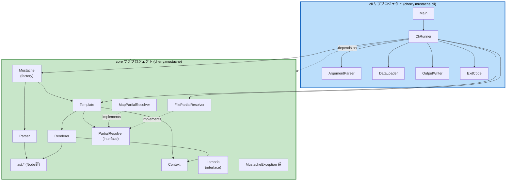

# Component Dependency

## 依存関係マトリクス

| コンポーネント | 依存先 |
|---|---|
| `Mustache` | `Parser`, `Template` |
| `Template` | `Renderer`, `Context`, `PartialResolver` |
| `Parser` | `ast.*`（AST Nodes）, `MustacheParseException` |
| `ast.*`（各Node） | `Context`, `PartialResolver`, `MustacheRenderException` |
| `Renderer` | `ast.*`（AST Nodes）, `Context`, `PartialResolver` |
| `Context` | （なし。純粋なデータ解決ロジック） |
| `MapPartialResolver` | `PartialResolver`（interface実装） |
| `FilePartialResolver` | `PartialResolver`（interface実装） |
| `Lambda` | （なし。呼び出し側が実装する契約のみ） |
| `CliRunner` | `ArgumentParser`, `DataLoader`, `FilePartialResolver`（core）, `Mustache`, `Template`, `OutputWriter`, `ExitCode` |
| `Main` | `CliRunner`, `ExitCode` |
| `ArgumentParser` | `CliArguments`, `ArgumentException` |
| `DataLoader` | `CliArguments`（JSON/YAMLパーサーライブラリはNFR Requirementsで選定） |
| `OutputWriter` | `CliArguments` |

## モジュール（Gradleサブプロジェクト）間の依存

```
cli サブプロジェクト
  └── depends on → core サブプロジェクト
```

`core`は`cli`に依存しない（一方向）。`core`は外部ライブラリへの依存を最小限（標準ライブラリ中心）に保ち、`cli`のみがJSON/YAMLパーサーライブラリ等の追加依存を持つ。

## コンポーネント関連図



### テキスト代替（コンポーネント関連図）

```
[core] Mustache --> Parser, Template
[core] Parser --> ast.*(Node群)
[core] Template --> Renderer, Context, PartialResolver
[core] Renderer --> ast.*(Node群), Context
[core] MapPartialResolver ..implements.. PartialResolver
[core] FilePartialResolver ..implements.. PartialResolver

[cli] Main --> CliRunner
[cli] CliRunner --> ArgumentParser, DataLoader, OutputWriter, ExitCode
[cli] CliRunner --> (core) Mustache, Template, FilePartialResolver

依存方向: cli サブプロジェクト → core サブプロジェクト（一方向、逆方向の依存なし）
```

## 通信パターン
- コンポーネント間はすべて**同期的な直接メソッド呼び出し**（インプロセス）。非同期処理・メッセージング・ネットワーク通信は存在しない
- `PartialResolver`はStrategyパターンとして機能する。標準実装（`MapPartialResolver`, `FilePartialResolver`）はいずれも`core`が提供し、CLI固有の概念を含まない汎用クラスとして設計する（`cli`→`core`の一方向依存を維持するための設計）。「どのディレクトリを使うか」というポリシー決定のみ`cli`（`CliRunner`）の責務とする
