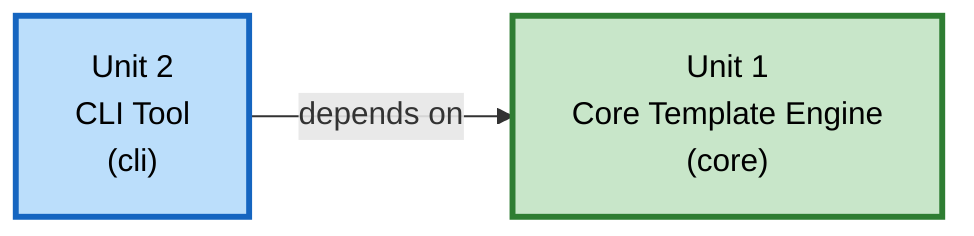

# Unit of Work Dependency

## 依存マトリクス

| Unit | 依存先Unit | 依存の種類 |
|---|---|---|
| Unit 1: Core Template Engine（`core`） | なし | - |
| Unit 2: CLI Tool（`cli`） | Unit 1: Core Template Engine | Gradleプロジェクト依存（コンパイル時・実行時とも） |

## 依存関係図



### テキスト代替
```
Unit 2 (CLI Tool) --> depends on --> Unit 1 (Core Template Engine)
Unit 1 は Unit 2 に依存しない（一方向）
```

## 開発・ビルド順序
1. **Unit 1: Core Template Engine** を先に実装・テストする（Functional Design → NFR Requirements → NFR Design → Code Generation の順）
2. Unit 1が完了した後、**Unit 2: CLI Tool** に着手する（Unit 1の公開API・例外階層・`PartialResolver`実装が確定していることが前提）
3. 両Unit完了後、Build and Testステージで統合的なビルド・テストを実施する

## 通信・結合方式
- Unit間の連携はGradleのプロジェクト依存（`cli/build.gradle.kts`で`implementation(project(":core"))`）によるコンパイル時結合のみ
- ネットワーク通信・非同期メッセージングは存在しない
- Unit 1はUnit 2の存在を一切知らない（`core`から`cli`への参照は無い）
