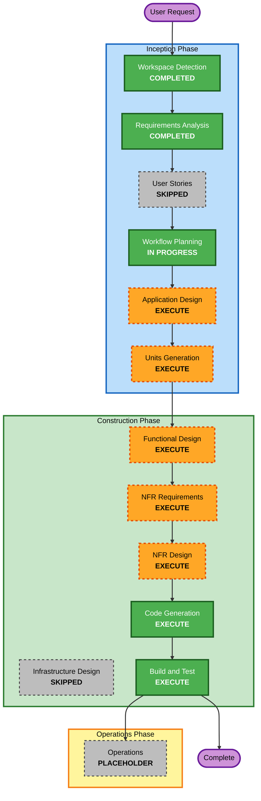

# Execution Plan

## Detailed Analysis Summary

### Transformation Scope
本プロジェクトはGreenfield（新規）プロジェクトであり、ブラウンフィールド固有の分析（移行スコープ、コンポーネント関係図、パッケージ更新順序）は対象外。

### Change Impact Assessment
- **User-facing changes**: Yes — ライブラリAPI（Java開発者向け）とCLI（コマンドライン利用者向け）という2種類の利用者インターフェースを新規提供する
- **Structural changes**: Yes — 新規プロジェクトのため、テンプレートエンジン本体（パーサー／レンダラー）、ライブラリAPI、CLIという複数コンポーネントからなる構造を最初から設計する
- **Data model changes**: Yes — テンプレートの内部表現（AST/コンパイル済み表現）、コンテキストスタック、パーシャルリゾルバー等の新規データモデルが必要
- **API changes**: Yes — ライブラリAPI（Map/POJO入力、カスタムリゾルバー、ラムダ対応）とCLIインターフェース（引数仕様、終了コード）を新規設計する
- **NFR impact**: Yes — Security BaselineおよびProperty-Based Testing拡張が有効化されており、設計・実装の両方に影響する

### Risk Assessment
- **Risk Level**: Medium — 複数コンポーネント（パーサー、レンダラー、ライブラリAPI、CLI）にまたがる新規実装であり、公式Mustache仕様のフルサポート（ラムダ・デリミタ変更等）という一定の技術的複雑度がある。一方でMustache仕様自体は公式spec/テストスイートとして明確に定義されており、要件の不確実性は低い
- **Rollback Complexity**: Easy — 新規プロジェクトのため既存システムへの影響がなく、ロールバックは単純（未リリースのコードを破棄するのみ）
- **Testing Complexity**: Moderate — 単体テストに加え、公式specテストスイート準拠テストとProperty-Based Testingを組み合わせる必要がある

## Workflow Visualization



### Text Alternative

```
INCEPTION PHASE
- Workspace Detection      : COMPLETED
- Requirements Analysis    : COMPLETED
- User Stories             : SKIPPED
- Workflow Planning        : IN PROGRESS (this document)
- Application Design       : EXECUTE
- Units Generation         : EXECUTE

CONSTRUCTION PHASE (per unit: Core Template Engine, then CLI Tool)
- Functional Design        : EXECUTE
- NFR Requirements         : EXECUTE
- NFR Design                : EXECUTE
- Infrastructure Design    : SKIPPED
- Code Generation          : EXECUTE (always)
- Build and Test           : EXECUTE (always, after all units)

OPERATIONS PHASE
- Operations                : PLACEHOLDER
```

## Phases to Execute

### Inception Phase
- [x] Workspace Detection (COMPLETED)
- [x] Requirements Analysis (COMPLETED)
- [x] User Stories (SKIPPED)
  - **Rationale**: 開発者向けのライブラリ／CLIであり、複数の利用者ペルソナや業務プロセス上の受け入れ基準を必要とする性質のプロジェクトではないため
- [x] Workflow Planning (IN PROGRESS — this document)
- [ ] Application Design — **EXECUTE**
  - **Rationale**: パーサー、AST（内部表現）、レンダラー、コンテキストスタック、パーシャルリゾルバー、ラムダ呼び出し、CLIモジュール、データローダー（JSON/YAML）など、複数の新規コンポーネントの責務と依存関係を最初に整理する必要があるため
- [ ] Units Generation — **EXECUTE**
  - **Rationale**: ライブラリ本体（コアテンプレートエンジン）とCLIツールは依存関係を持つ別々の成果物であり、複数パッケージ（Gradleサブプロジェクト）にまたがる実装になるため、Unit of Workとして明確に分割する

### Construction Phase（ユニットごとに実行）
- [ ] Functional Design — **EXECUTE**
  - **Rationale**: パース/レンダリングのアルゴリズム、空白・スタンドアロン行の扱いなど公式仕様特有の詳細設計が必要。またProperty-Based Testing拡張（PBT-01）により、Functional Designの段階でテスト対象プロパティ（Round-trip, Invariant, Oracle等）を識別する必要がある
- [ ] NFR Requirements — **EXECUTE**
  - **Rationale**: JSON/YAMLパーサーライブラリの選定、PBTフレームワーク（jqwik）の確定、依存脆弱性スキャンツールの選定（Q10で本ステージへの決定委譲が確認済み）が必要
- [ ] NFR Design — **EXECUTE**
  - **Rationale**: Security Baseline（安全なデシリアライズ、入力検証、フェイルセーフなエラー処理等）およびPBTのテスト構成パターンを設計に組み込む必要がある
- [ ] Infrastructure Design — **SKIP**
  - **Rationale**: 本プロジェクトはクラウドインフラを持たないライブラリ／CLIであり、デプロイアーキテクチャやクラウドリソースのマッピングは対象外
- [ ] Code Generation — EXECUTE (ALWAYS)
  - **Rationale**: 実装計画の作成とコード生成が必要
- [ ] Build and Test — EXECUTE (ALWAYS)
  - **Rationale**: ビルド・テスト・検証が必要（全ユニット完了後に一括実行）

### Operations Phase
- [ ] Operations — PLACEHOLDER
  - **Rationale**: 将来のデプロイ・監視ワークフロー用のプレースホルダー（現状は対象外）

## Unit of Work（想定、Units Generationステージで確定）
- **Unit 1: Core Template Engine** — パーサー、AST、レンダラー、コンテキスト解決、パーシャルリゾルバー、ラムダ呼び出しを含むライブラリ本体
- **Unit 2: CLI Tool** — Unit 1に依存し、コマンドライン引数処理、JSON/YAMLデータローダー、標準入出力処理、終了コード制御を担当

正式な分割・依存関係はUnits Generationステージで確定する。

## Estimated Timeline
- **Total Phases**: Inception（Application Design, Units Generation） + Construction（2ユニット × Functional Design/NFR Requirements/NFR Design/Code Generation） + Build and Test
- **Estimated Duration**: セッションベースでの反復的な進行（時間単位の見積もりは行わない）

## Success Criteria
- **Primary Goal**: 公式Mustache仕様にフル準拠したJava向けテンプレートエンジンをライブラリとして実装し、あわせてCLIツールを提供する
- **Key Deliverables**:
  - Mustacheテンプレートエンジン（ライブラリ、ラムダ・パーシャル・デリミタ変更等フル仕様対応）
  - CLIツール（複数テンプレート連結出力、JSON/YAML入力、標準入出力対応）
  - JUnit 5単体テスト、公式specテストスイート準拠テスト、Property-Based Testing（jqwik）
- **Quality Gates**:
  - Security Baseline該当ルールの遵守（N/A判定を含む）
  - Property-Based Testing該当ルールの遵守
  - 公式specテストスイートの全項目合格
